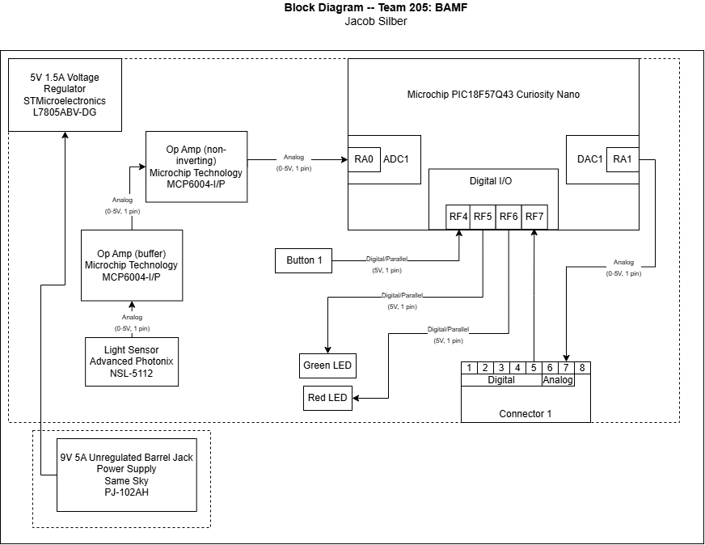

## Overview
This Block Diagram shows the lighting sensor of Team BAMF's plant monitor system. It uses a lighting sensor to determine whether or not the plant is recieving enough light, and then communicates with a teammate's board to move a shade to increase or decrease the light level.

The Block Diagram shows the important wiring of components to the microcontroller, as well as the microcontroller peripherals, to document the necessary details of the system for communication and replication purposes.

## Block Diagram 

